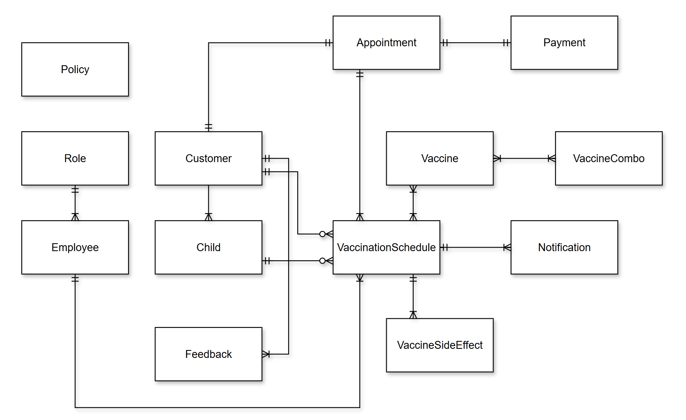
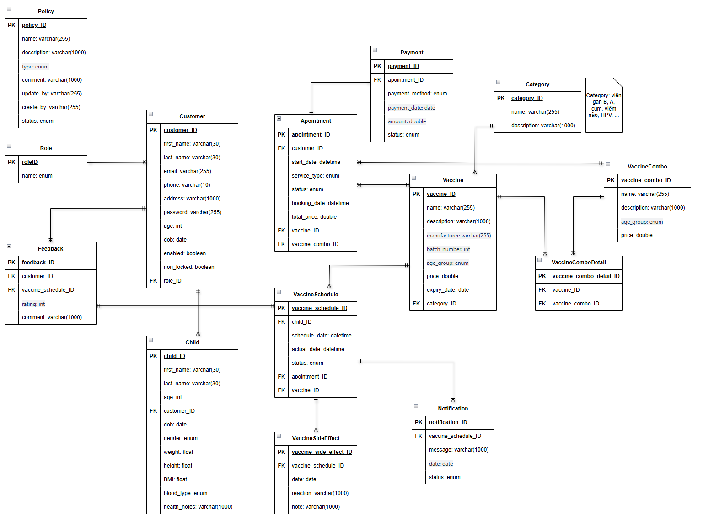

# Child Vaccine Schedule Tracking System - Phần mềm quản lý và theo dõi lịch tiêm chủng của trẻ em

## I - GIVEN

### Phần mềm quản lý và theo dõi lịch tiêm chủng cho trẻ em tại 01 cơ sở tiêm chủng

- Trang chủ giới thiệu thông tin cơ sở tiêm chủng, dịch vụ tiêm chủng, bảng giá, cẩm nang tiêm chủng, ...
- Chức năng cho phép khách hàng cập nhật thông tin hồ sơ trẻ em, quá trình tiêm chủng, ....
- Hệ thống cung cấp cho khách hàng lịch tiêm chủng cho trẻ em và các mũi tiêm cần thiết theo từng độ tuổi.
- Chức năng cho phép khách hàng đặt lịch tiêm chủng theo các dịch vụ linh hoạt: tiêm lẻ, trọn gói, cá thể hóa, ...
- Quản lý quá trình tiêm chủng:

  - **Khách hàng đặt lịch tiêm chủng --> Thực hiện đến tiêm chủng tại cơ sở --> Cơ sở ghi nhận kết quả tiêm chủng vào hồ sơ của trẻ --> Khách hàng thực hiện thanh toán --> Khách hàng đánh giá cơ sở tiêm chủng**

- Chức năng cho phép khách hàng nhận được thông báo nhắc nhở về các mũi tiêm tiếp theo để không bỏ quên mũi tiêm cần thiết của trẻ.
- Chức năng cho phép khách hàng ghi nhận thông tin phản ứng của mũi tiêm (nếu có).
- Quản lý chính sách thanh toán và hủy đơn đặt lịch tiêm chủng.
- Khai báo thông tin dịch vụ tiêm chủng, bảng giá, ...
- Quản lý rating, feedback.
- Quản lý hồ sơ khách hàng, lịch sử đơn đặt lịch tiêm chủng.
- Dashboard & Report.
  Link tham khảo:
  - https://vnvc.vn/
  - https://www.cdc.gov/vaccines/?CDC_AAref_Val=https://www.cdc.gov/vaccines/schedules/

## II - USER REQUIREMENTS

### 1. Quản lý khách hàng

- Thông tin cơ bản của khách hàng (tên, email, số điện thoại, địa chỉ, ...)
- Hồ sơ trẻ em (tên, ngày sinh, giới tính, cân nặng, chiều cao, tiền sử bệnh, ...)
- Lịch sử tiêm chủng của từng trẻ em
- Feedback và đánh giá của khách hàng

### 2. Quản lý vaccine

- Danh sách vaccine
  - Tên vaccine
  - Nhà sản xuất
  - Mã vaccine
  - Số lô
  - Thời gian hiệu lực (hạn sử dụng)
- Vaccine theo từng độ tuổi
- Vaccine nhóm (combo tiêm trọn gói)
- Giá vaccine (lẻ, combo, cá thể hóa)
- Mô tả thông tin chi tiết của vaccine

### 3. Quản lý lịch tiêm chủng

- Lịch tiêm dành cho nhân viên:
  - Thông tin chi tiết từng lịch tiêm
  - Trạng thái (đã thực hiện, đã hủy, đang chờ, ...)
  - Tên nhân viên phụ trách
- Lịch tiêm dành cho khách hàng:
  - Thông tin chi tiết lịch tiêm
  - Trạng thái đặt lịch (đã thanh toán, chưa thanh toán, đã hủy, ...)
  - Thông báo nhắc lịch
  - Danh sách lịch tiêm theo gói hoặc tiêm lẻ

### 4. Quản lý quá trình tiêm chủng

- Quy trình:
  - Đặt lịch tiêm
  - Đến cơ sở tiêm
  - Ghi nhận kết quả tiêm chủng
  - Thanh toán
  - Ghi nhận đánh giá
- Kết quả sau khi tiêm:
  - Ghi nhận phản ứng sau tiêm (nếu có)
  - Kế hoạch tiêm tiếp theo
  - Cập nhật vào hồ sơ trẻ em

### 5. Quản lý chính sách đặt lịch, thanh toán, và hủy đơn

- Chính sách đặt lịch:
  - Quy định về thời gian đặt lịch
  - Loại dịch vụ (lẻ, combo, cá thể hóa)
- Chính sách thanh toán:
  - Các phương thức thanh toán (tiền mặt, thẻ, online banking, ...)
  - Hóa đơn và chi tiết thanh toán
- Chính sách hủy đơn:
  - Thời gian cho phép hủy
  - Chi phí phát sinh (nếu có)
  - Ghi nhận lý do hủy

### 6. Quản lý rating và feedback

- Đánh giá của khách hàng (sao, bình luận)
- Thống kê và báo cáo về mức độ hài lòng
- Quản lý phản hồi từ cơ sở tiêm chủng

### 7. Quản lý dịch vụ tiêm chủng

- Danh sách các dịch vụ tiêm chủng:
  - Tiêm lẻ
  - Tiêm trọn gói
  - Tiêm cá thể hóa
- Cập nhật bảng giá
- Khai báo các thông tin liên quan (ưu đãi, chính sách, ...)

### 8. Dashboard và báo cáo

- Thống kê:
  - Lịch tiêm theo ngày, tuần, tháng
  - Doanh thu theo dịch vụ
  - Đánh giá và phản hồi từ khách hàng
- Báo cáo:
  - Số lượng trẻ em tiêm chủng
  - Tỷ lệ hủy đơn
  - Hiệu quả các combo tiêm

### 9. Thông báo và nhắc nhở

- Gửi thông báo nhắc lịch qua email
- Nhắc lịch tiêm tiếp theo dựa trên độ tuổi và thời gian tiêm trước đó

### 10. Quản lý nhân viên

- Danh sách nhân viên (tên, vai trò, chuyên môn, ...)
- Phân công lịch làm việc
- Quản lý hiệu suất nhân viên

## III - PRIMARY ACTORS

- Guest
- Customer
- Staff
- Admin

## IV - ENTITY RELATIONSHIP DIAGRAM

